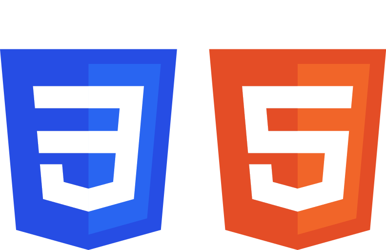

# 

----------------------------------------------------------------

## Curso HTML5 e CSS3 do CursoEmVideo

**Projeto prático do curso, escaneie o código QR abaixo.**

<https://github.com/JuniorThume/HTML-CSS/blob/main/Flexbox/desafios/d001/login.html>

## Tags Semânticas

* Block-level
  * \<address>
  * \<article>
  * \<aside>
  * \

  * \<dl>
  * \<dt>
  * \<footer>
  * \<form>
  * \<h1> - \<h6>
  * \<main>
  * \<nav>
  * \<noscript>
  * \<section>
  * \<table>
  * \<tfoot>
  * \<blockquote>
  * \<canvas>
  * \<dd>
  * \<fieldset>
  * \<figcaption>
  * \<figure>
  * \<header>
  * \

  * \<li>
  * \<ol>
  * \

  * \<ple>
  * \<ul>
  * \<video>
  
* Inline-level
  * \<a>
  * \<output>
  * \<cite>
  * \<strong>
  * \<kbd>
  * \<button>
  * \
  * \<input>
  * \<acronym>
  * \<samp>
  * \
  * \<abbr>
  * \<q>
  * \<code>
  * \
  * \<b>
  * \<bdo>
  * \ 
  * \<dfn>
  * \<em>
  * \<i>
  * \<label>
  * \<map>
  * \<object>
  * \<script>
  * \<select>
  * \<small>
  * \<textarea>
  * \<tt>
  * \<var>

## Hierarquia de Titulos

* h1
* h2
* h3
* h4
* h5
* h6

## Imagens

* Formatos compatíveis com navegadores
  * PNG (transparência)
  * JPeG (Compactação)
* Dimensão
  * Largura x Altura
* SOURCES para inserir imagem com base no tamanho da Viewport
* Unidades de tamanho
  * Medidas Absolutas
    * cm
    * mm
    * px
    * in (polegada)
    * pt (ponto)
    * pc
  * Medidas Relativas
    * em (relativa ao tamanho atual da fonte)
    * rem (relativa ao tamanho que está configurado no root)
    * ex (relativa à altura-x de uma fonte)

## Videos

* Utilizando vídeos do YouTube
* Vídeos armazenados na pasta do projeto
* Atributos para inserir vídeo no HTML5

## Fontes

* Tipos de fontes
* Anatomia das letras
  * Família de fontes
  * Pesos de fontes
  * Bold
  * Bolder
  * Normal
  * 100 - 900
* Tamanhos
* Serif e Sans-serif

## Cores

* Circulo Cromático
  * Cores Monocromáticas
  * Cores Análogas
  * Cores Complementares
  * Cores Intercaladas
  * Cores Triádicas
  * Cores Tetrádicas
  * Cores em Quadrado
  * Cores Análogas relacionadas
* Paletas de cores harmônicas
* Adobe Color

## Git e GitHub

* Comandos
  * git init
  * git remote add origin (url do repositório)
  * git branch -M main
  * git add
  * git commit
  * git push
  * git pull
  * git clone (url do repositório)
